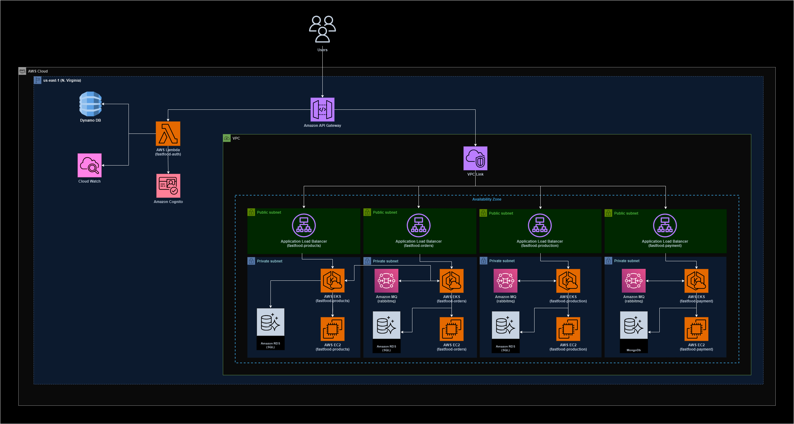
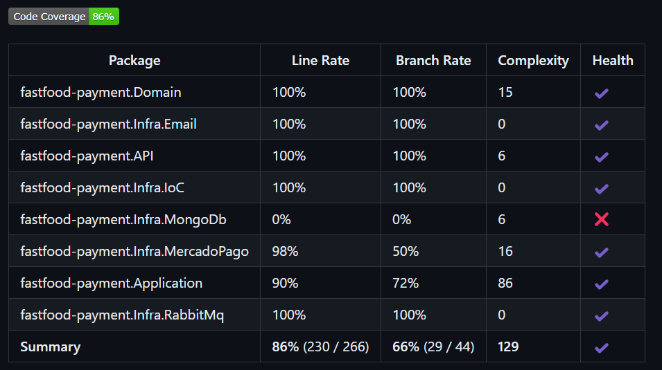

# fastfood-payment

O repositorio fastfood-payment tem por objetivo disponibilizar os CRUDs para geração e recebimento de pagamento do pedido do fastfood, utilizando o MongoDb para persistência dos dados.

## Github Actions
### Necessário
* Configurar no GitHub as *Secrets and variables*, entrando em *Actions* e adicionando na parte *Repository secrets* a seguinte:
  * AWS_ACCESS_KEY_ID 
  * AWS_SECRET_ACCESS_KEY
* Rodar a primeira run no [Repositório Terraform](https://github.com/pos-4soat/fastfood-infra), para criação do ECR e RDS do SQL

Esse projeto tem um workflow de subir a imagem do projeto ao ECR ao realizar o merge para a branch main.

Fluxo:
* RUN 1 do terraform
* Atualizar secret com host de rabbitmq
* Workflow para realizar o deploy da imagem no ECR

## Execução do projeto
Para executar o projeto é fácil, basta apenas definir os valores paras as variáveis de ambiente dele, que se encontram no launchsettings.json da API.
Após isso, basta executar o projeto da forma que preferir, nós utilizamos o Docker para isso.

### Variáveis de ambiente
Todas as variáveis de ambiente do projeto visam fazer integração com algum serviço da AWS. Explicaremos a finalidade de cada uma:

- MongoConnection: Conexão com banco de dados MongoDb. Recurso gerado externamente em relação à plataforma da AWS;

## Arquitetura do projeto
A seguinte arquitetura foi utilizada para o projeto:



Como decidimos utilizar a AWS como plataforma nuvem, utilizamos o ECR para armazenar e gerenciar a imagem do contêiner da aplicação, EKS para implantar e gerenciar a aplicação em um cluster Kubernetes, HPA para escalar horizontalmente a aplicação . 
Para gerenciar melhor os dados dos pagamentos de pedidos, optamos por utilizar o MongoDb. Por ser um banco de dados NoSQL, pensamos em utilizá-lo para armazenar os dados dos pagamentos retornados pela API do MercadoPago. Nessa solução, foi utilizada apenas a collection de Pagamentos.
Esse projeto possui uma conexão com o projeto de pedidos e produção, para atualização e acompanhamento do status dos pedidos e geração da produção do pedido, mediante ao pagamento.

## Endpoints

Esse projeto possui 1 endpoint:

POST /payment/{orderId} -> Responsável por receber retorno de um pagamento via MercadoPago com o seguinte json.
```
{
  "action": "payment.created",
  "api_version": "v1",
  "data": {
    "id": "123456"
  },
  "date_created": "2024-01-01T00:00:00Z",
  "id": 123456789,
  "live_mode": true,
  "type": "payment",
  "user_id": "1612954"
}
```


## Cobertura de código
Fluxo de cobertura de código está presente no workflow, utilizando coverlet para gerar relatório:



### Saga pattern
A escolha da coreografia de saga pattern para a arquitetura de microsserviços do sistema de fast food totem é justificada pelo seu desacoplamento, simplicidade e independência dos serviços, permitindo que cada microsserviço ouça e reaja a eventos de forma automático e individualizado. Isso facilita a escalabilidade e a adição de novos serviços sem depender de um orquestrador central. A coreografia também melhora a resiliência, pois falhas em um serviço não impactam os outros, e proporciona maior flexibilidade para adaptar fluxos de trabalho.
Em sumo a coreografia de saga pattern oferece uma arquitetura flexível, escalável e resiliente, permitindo a evolução contínua dos serviços, facilitando a adição de novos componentes e garantindo a tolerância a falhas individuais sem comprometer o funcionamento geral do sistema.
